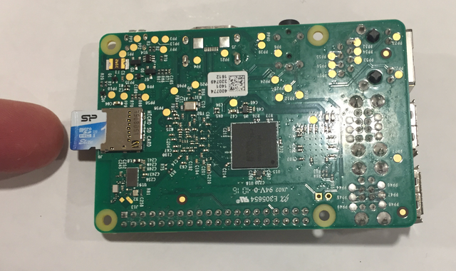
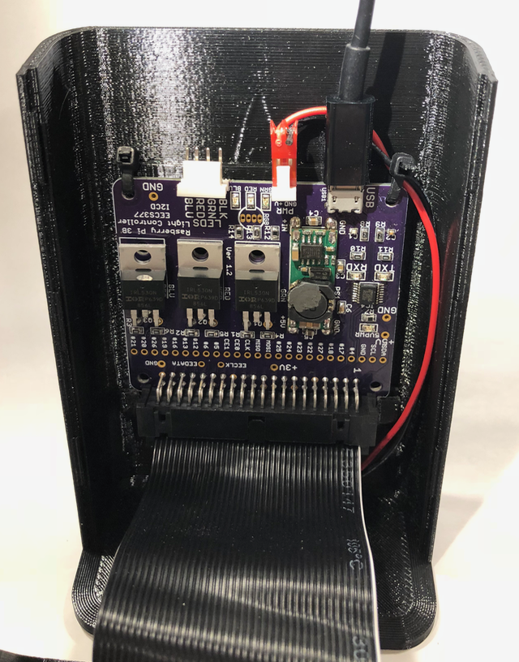

# Connecting Serial and WiFi Setup

## Inserting the SD Card into the Pi

Your SD Card will go into the SD slot in the BACK of the Pi. Make sure to insert the card in the proper orientation.
 


## Connecting the Pi

**NOTE:** you will need to get the serial connection working eventually, but if you are having troubhle with the following, skip ahead to the WiFi section and use the `/boot/wpa_supplicant.conf` trick to get LAMPI on the WiFi network.

7. Carefully connect the Micro-USB Cable to the Micro-USB connector on the board, matching the cable orientation to match the connector.
<br/>**BE VERY, VERY CAREFUL WITH THE MICRO-USB CONNECTION - IT HAS MINIMAL STRAIN RELIEF AND CAN BE PULLED OFF THE BOARD IF YOU ARE CARELESS**
<br/>
<br/>**BE VERY, VERY CAREFUL WITH THE MICRO-USB CONNECTION - IT HAS MINIMAL STRAIN RELIEF AND CAN BE PULLED OFF THE BOARD IF YOU ARE CARELESS**
8.  Plug the power cord into an AC outlet, then plug the power adapter into the LAMPI.  The Pi should have a steady red light on.
9.  Plug the USB part of the Serial Cable into your USB port of your computer.
10. Install any necessary software or drivers specific to you OS as documented in [using a console cable](https://learn.adafruit.com/downloads/pdf/adafruits-raspberry-pi-lesson-5-using-a-console-cable.pdf)
11. Then in your terminal emulator, connect to your Pi. 
![Connected Pi Serial Terminal] (Images/Connect_Pi_Serial_Terminal.png)
![Terminal Settings] (Images/Terminal_Settings.png)
The Line Settings within Terminal Settings should be:
	* Baud Rate: 115200
	* Data Bits: 8
	* Parity: None
	* Stop: 1
12. Log into your Raspberry Pi:
	* login: ``pi``
	* password: `r`aspberry``
13. Run `sudo raspi-config` to perform initial setup.
14. Highlight `1 Expand Filesystem` and press enter. Follow the prompts.
15. Highlight `2 Change User Password` and choose a new password.

**Congratulations, your LAMPI is up and running!**

## Now let's connect your Raspberry Pi to WiFi via the Command Line.

**NOTE:** your Raspberry Pi is about to be connected to the network - you _must_ change the password from the default. In several cases, we have seen Raspberry Pis with default passwords become compromised within 10-15 minutes of being connected to the internet. When this happens it can be destructive but not immediately obvious.


Some helpful instructions: [https://www.raspberrypi.org/documentation/configuration/wireless/wireless-cli.md](https://www.raspberrypi.org/documentation/configuration/wireless/wireless-cli.md)

**NOTE:** the Linux `sudo` command allows you to execute commands as another user.  By default, that other user is _root_, the superuser.  Executing commands as _root_ can be dangerous - you can, for example, delete every file on the system.  That would probably be bad.  We will require superuser privileges to access certain hardware devices, change system settings, and generally muck about with the Raspian system.

Use sudo carefully.  [Don't let the power go to your head.](https://xkcd.com/149/)

### Configure Your Wireless Network

1. In the terminal, scan for WiFi networks via `sudo iwlist wlan0 scan`. You'll see networks listed. You'll want to find the name of the network and password.
	* The name of the network is from either ssid or ESSID.
2. Add the network details to your Raspberry Pi.  A configuration for connecting to "CaseGuest" and "csuguest" is shown below.
	* Using whatever terminal text editor you prefer ([https://www.raspberrypi.org/documentation/linux/usage/text-editors.md](https://www.raspberrypi.org/documentation/linux/usage/text-editors.md)), open the `wpa_supplicant.conf` configuration file. The command will look something like: `sudo vi /etc/wpa_supplicant/wpa_supplicant.conf`.
	* The configuration file will open, add the information for your network below the existing content. 

    ```
    country=US
    ctrl_interface=DIR=/var/run/wpa_supplicant GROUP=netdev
    update_config=1


    network={
        ssid="CaseGuest"
        key_mgmt=NONE
    }

    network={
        ssid="csuguest"
        key_mgmt=NONE
    }
    ```
	* Save the updated `wpa_supplicant.conf` file.
3. At this stage, reboot your Raspberry Pi via `sudo reboot` (a reboot is not strictly necessary, but it is the easiest way to ensure all of the network configurations are updated).
4. After the pi reboots, login again via the serial console and test your network connection via `ping www.google.com` to verify that you are connected to the Internet.
5. Test that ssh is working.  Get the IP address of your Pi via `ifconfig` which will have output like

    ```
    nbarendt@nick-raspberrypi:~$ ifconfig
    eth0      Link encap:Ethernet  HWaddr b8:27:eb:2f:9f:38  
              UP BROADCAST MULTICAST  MTU:1500  Metric:1
              RX packets:0 errors:0 dropped:0 overruns:0 frame:0
              TX packets:0 errors:0 dropped:0 overruns:0 carrier:0
              collisions:0 txqueuelen:1000
              RX bytes:0 (0.0 B)  TX bytes:0 (0.0 B)

    lo        Link encap:Local Loopback  
              inet addr:127.0.0.1  Mask:255.0.0.0
              UP LOOPBACK RUNNING  MTU:65536  Metric:1
              RX packets:72 errors:0 dropped:0 overruns:0 frame:0
              TX packets:72 errors:0 dropped:0 overruns:0 carrier:0
              collisions:0 txqueuelen:0
              RX bytes:6288 (6.1 KiB)  TX bytes:6288 (6.1 KiB)

    wlan0     Link encap:Ethernet  HWaddr 00:13:ef:30:02:72  
              inet addr:10.0.1.34  Bcast:10.0.1.255  Mask:255.255.255.0
              UP BROADCAST RUNNING MULTICAST  MTU:1500  Metric:1
              RX packets:40 errors:0 dropped:4 overruns:0 frame:0
              TX packets:45 errors:0 dropped:0 overruns:0 carrier:0
              collisions:0 txqueuelen:1000
              RX bytes:6883 (6.7 KiB)  TX bytes:8131 (7.9 KiB)
    ```

    SSH is the "Secure Shell".  Linux and Mac's have an SSH client installed by default.  If you are on Windows, consider [PuTTy](http://www.putty.org/).  
    Fom ssh to your Raspberry Pi's IP address via 

    ```
    ssh -l pi PUT_YOUR_PIS_IP_ADDRESS_HERE
    ```

     or, alternatively, 

    ```
    ssh pi@PUT_YOUR_PIS_IP_ADDRESS_HERE
    ```

### `/boot/wpa_supplicant.conf` trick

Recently releases of Raspbian support a convenient trick to configure WiFi.  You can put an appropriately configured `wpa_supplicant.conf` file in the `/boot` partition on the SD card when it is inserted into your computer and mounted.  At boot time, a helper script will check `/boot` for a `wpa_supplicant.conf` file; if the file is found, it is moved to `/etc/wpa_supplicant/wpa_supplicant.conf` replacing any file that might be there already.  (This is similar to the trick of creating an `ssh` file in `/boot`, which we did previously, to enable the SSH Server).

Here's how to use this trick, if needed:

1. Power off LAMPI / Raspberry Pi
1. Remove SD Card from the Raspberry Pi
1. Insert SD Card into your computer
1. Mount the `/boot` partition, if needed
1. Create a properly formatted `wpa_supplicant.conf` file in `/boot`
1. Unmount `/boot` / Properly Eject the SD card from your computer
1. Insert the SD Card into the Raspberry Pi
1. Power LAMPI / Rasbperry Pi


### Disable Wireless Power Management

Typically, you want your devices to reduce their energy usage.  For instance, a default configuration for Raspbian on the Raspberry Pi 3 is to put the WiFi interface to sleep if it is idle for a certain lenght of time.  This creates some problems for us, though, as LAMPI will disappear from the wireless network if there is no wireless traffic.  We therefore need to disable power management on the WiFi interface.
n

1.  Using your preferred text editor open the ```/etc/network/interfaces``` file as root.  The command will look something like: ```sudo vi /etc/network/interfaces```.
t
2.  Edit the file to include ```wireless-power off``` after the ```iface wlan0 inet manual``` line, like so:

    ```
    # interfaces(5) file used by ifup(8) and ifdown(8)
     
    # Please note that this file is written to be used with dhcpcd
    # For static IP, consult /etc/dhcpcd.conf and 'man dhcpcd.conf'
     
    # Include files from /etc/network/interfaces.d:
    source-directory /etc/network/interfaces.d
     
    auto lo
    iface lo inet loopback
     
    iface eth0 inet manual
     
    allow-hotplug wlan0
    iface wlan0 inet manual
        wireless-power off
        wpa-conf /etc/wpa_supplicant/wpa_supplicant.conf
     
    allow-hotplug wlan1
    iface wlan1 inet manual
        wpa-conf /etc/wpa_supplicant/wpa_supplicant.conf
    ```

7. At this stage, power down your Raspberry Pi via `sudo poweroff` and disconnect the power.

Next up: go to [Interface LED](../01.4_Interface_LED/README.md)

&copy; 2015-17 LeanDog, Inc. and Nick Barendt
