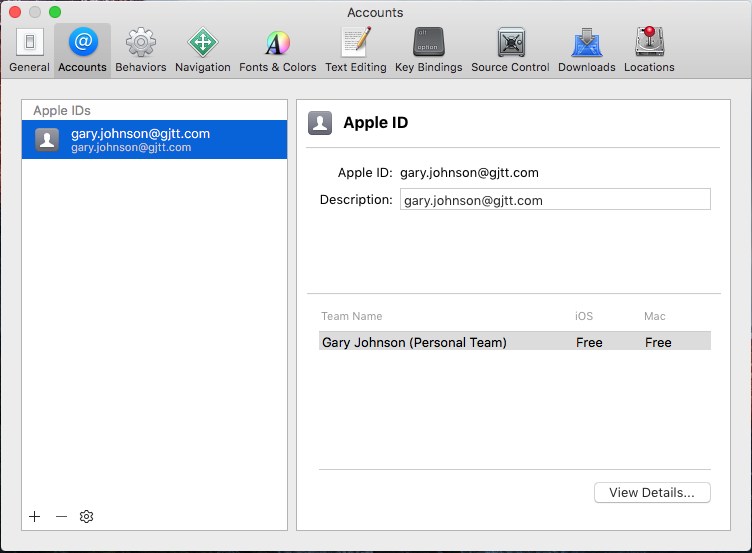

# iOS Environment Setup

In this chapter we are going to create an iOS app that replicates our Kivy UI. In the next chapter we will use this app to control our lamps using Bluetooth Smart (BTLE). Before we start writing iOS apps, however, we need to set up our development evironment.

### Create an Apple ID

You can use an existing Apple ID or you can [create a new one](https://appleid.apple.com).

### Install XCode

You need a Mac running OSX to develop iOS applications. You will also need Xcode. On your mac, open the **App Store** and search for **Xcode** and download.

> **COMPATIBILITY:** the coursware is targeted at the current version of XCode (9.2)

> Note: if you do not have a Mac, you university has a computer lab with Mac computers and XCode installed. 

### Add Apple ID to XCode
When XCode opens, go to **XCode** > **Preferences** (or press ⌘ + ,). Select the **Accounts** tab and click the add button (**+**) and **Add Apple ID...**.

Sign in with your Apple ID. Your Accounts page should now look something like this:
 

Next up: [iOS New Project](../08.2_iOS_New_Project/README.md)

&copy; 2015-18 LeanDog, Inc. and Nick Barendt
